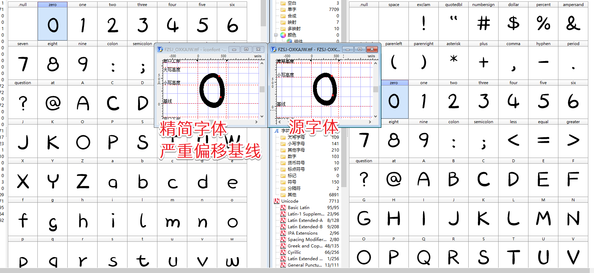

# 字体研究

## 研究背景

1. 不同系统支持的字体不同，出现与设计稿不一致的字体显示，影响统一性美观；
2. CSS 引入字体文件（含中文），文件大小过大，导致加载速度慢，影响体验效果。

## 深入 font

看了下 IconFont 大神 Purplebamboo 的两篇博客，对 iconfont 有了一些初步的认识，虽然是比较老的文章了，现在这个博客也没有继续更新了，但是这两篇文章对于我这方面的学习还是有很大的参考价值的。

> [iconfont 记录](http://purplebamboo.github.io/2014/01/09/iconfont/) > [iconfont 字体生成原理及使用技巧](http://purplebamboo.github.io/2016/08/16/iconfont_code_and_use/)

1. 字体兼容性

    - IE：从 IE4 开始支持 eot 格式，IE9 开始支持 woff。
    - webkit/safari：支持 TrueType/OpenType(.ttf)，OpenType PS(.otf)，iOS4.2+支持.ttf，iOS 4.2 以下只支持 SVG 字体； Safari5.1+ 开始支持 woff 格式
    - Chrome：除 webkit 支持的以外，从 Chrome 6 开始，开始支持 woff 格式；
    - Firefox：支持.ttf 和.otf，从 Firefox 3.6 开始支持 woff 格式；
    - Opera：支持.ttf、.otf、.svg。 Opera 11 开始支持 woff；
    - iPad, iPhone and Android 3.0+ 支持 SVG fonts。
    - 字体格式一般为 4 种：.ttf、.eot、.svg、.woff

2. 使用方式

    1. 声明字体
        ```css
        @font-face {
            font-family: 'iconfont';
            src: url('iconfont.eot'); /* IE9*/
            src: url('iconfont.eot?#iefix') format('embedded-opentype'), /* IE6-IE8 */
                    url('iconfont.woff') format('woff'),
                /* chrome、firefox */ url('iconfont.ttf') format('truetype'), /* chrome、firefox、opera、Safari, Android, iOS 4.2+*/
                    url('iconfont.svg#uxiconfont') format('svg'); /* iOS 4.1- */
        }
        ```
    2. 定义使用 iconfont
        ```css
        .iconfont {
            font-family: 'iconfont';
            font-size: 16px;
            font-style: normal;
        }
        ```
    3. 对应图标字体使用
        ```html
        <i class="iconfont">!</i>
        <!-- unicode使用，html为&#x跟16进制数 -->
        <i class="iconfont">&#x0021</i>
        ```
        ```css
        .iconfont {
            display: inline-block;
        }
        .iconfont:after {
            font-family: 'emotion' Tahoma;
            display: inline-block;
            content: '\0021'; // CSS中调用是通过\[16进制数]
        }
        ```
    4. iconfont 注意点
        1. 跨域问题：字体需要同域才加载，跨域需要设置服务器请求头
        2. 字体图标存在锯齿问题
            ```css
            .iconfont {
                -webkit-font-smoothing: antialiased;
                -webkit-text-stroke-width: 0.2px;
            }
            ```
        3. ie 渲染 unicode 问题：16 进制需要加上;号

3. 原理及使用技巧
    1. 每个字符都有对应的 unicode 编码，如我对应的是&#x6211；字体的设置无非是对应的 Unicode 编码上对应的一个矢量图。我们可以通过一些字体查看编辑软件可以打开查看。我是用 High-Logic FontCreator 打开查看的。
    2. iconfont 只是通过不同的 Unicode 编码里面放置了不同的图标图像矢量图当成字体一样去使用。制作工具有[font-carrier](http://purplebamboo.github.io/font-carrier/)。不过这种通过字体定义 icon 的方式会存在无法支持多色和基线标准以及兼容性问题，后续被 svg 替代。
    3. 最主要是用精简工具来精简字体：[font-collector](https://github.com/JailBreakC/font-collector)

## 精简字体 font-collector 使用心得

1. 安装：
    ```bash
        npm install -g font-collector # npm最新的是0.0.1,github上边是0.1.0,不过0.1.0有bug,我没有调通,不懂commander,后续要学习下了,0.0.1不能通过配置文件,也无法进行文件忽略,等有时间再看看代码是怎么写的,改下源码
    ```
2. 用法：
    ```bash
        font-collector -f 源字体文件 -s 代码目录 -o 导出精简的字体文件
        # eg: font-collector -f .\lib\PingFangBold.ttf -s .\ -o .\fonts\MiniPingFangBold
    ```
3. 存在问题：只能转换中文，我改了源代码的 Unicode 编码范围的正则匹配，可以转更多的，但是存在基线严重偏下的现象
   
   

## 又找了个 fontmin

1. 安装：
    ```bash
         npm i -g fontmin # 1. 报错找不到python # > ttf2woff2@3.0.0 install
         # D:\softtool\nodejs\node_modules\fontmin\node_modules\ttf2woff2
         # > ((node-gyp configure && node-gyp build) > builderror.log) || (exit 0)
         # gyp ERR! configure error
         # gyp ERR! stack Error: Can't find Python executable
         # "C:\Users\Ztry\.windows-build-tools\python27\python.exe", you can set the
         # PYTHON env variable...
         # 跑去下了个python2.7，然后把全局path指向目录，npm config set python "C:\Python27\python.exe" # npm uninstall -g node-gyp fontmin ， 又重新安装 npm i -g node-gyp fontmin
         # mmp, 又报错
         # 2. 报错build error
         #> ((node-gyp configure && node-gyp build) > builderror.log) || (exit 0)
         # Warning: unrecognized setting VCCLCompilerTool/MultiProcessorCompilation
         # Warning: unrecognized setting VCCLCompilerTool/MultiProcessorCompilation # gyp ERR! build error
         # gyp ERR! stack Error: `C:\Windows\Microsoft.NET\Framework\v4.0.30319\msbuild.exe` failed with exit code: 1
         # 百度下，安装了 npm install sails --msvs_version=2013 -g
         # 重新卸载，安装npm uninstall -g node-gyp fontmin ， 又重新安装 npm i -g node-gyp fontmin
         # 终于过了，太难了
    ```
    
2. 用法：

    1. 命令行：需要全局安装 fontmin

        ```bash
            fontmin -h
            # Minify font seamlessly, font subsetter, webfont (eot, # woff, svg) converter.
            # Usage
            #     $ fontmin <file> [<output>]
            #     $ fontmin <directory> [<output>]
            #     $ fontmin <file> > <output>
            #     $ cat <file> | fontmin > <output>
            # Example
            #     $ fontmin fonts/* build
            #     $ fontmin fonts build
            #     $ cat foo.ttf | fontmin > foo-optimized.ttf
            # Options
            #     -t, --text                          require glyphs by text
            #     -b, --basic-text                    require glyphs # with base chars
            #     --font-family                       font-family for # @font-face CSS
            #     --css-glyph                         generate class # for each glyf. default = false
            #     -T, --show-time                     show time fontmin # cost
        ```

    2. 在 js 中配置，并 node，需要在项目目录下安装 fontmin

        ```js
            // fontmin.js
            const Fontmin = require('fontmin');
            var fontmin = new Fontmin()
            .src(srcPath)   // srcPath: 源字体路径
            .use(plugins)   // plugins: glyph、ttf2eot、ttf2woff、ttf2svg、css、svg2ttf、svgs2ttf、otf2ttf
            .dest(folder)   // fold: 输出目录
            .run(function(err,files,stream))    // 运行：如果有异常打印err
            // 详见：https://github.com/ecomfe/fontmin
        ```
